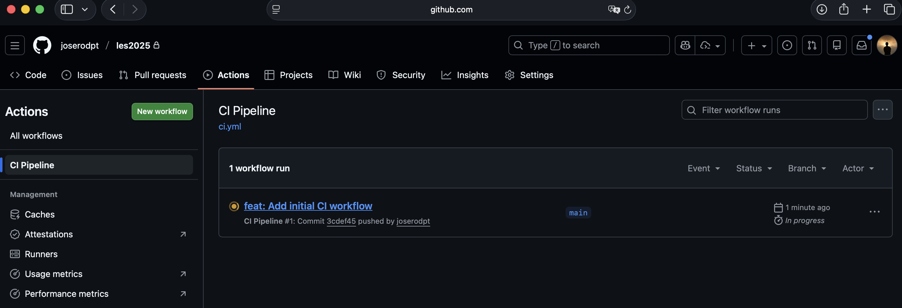
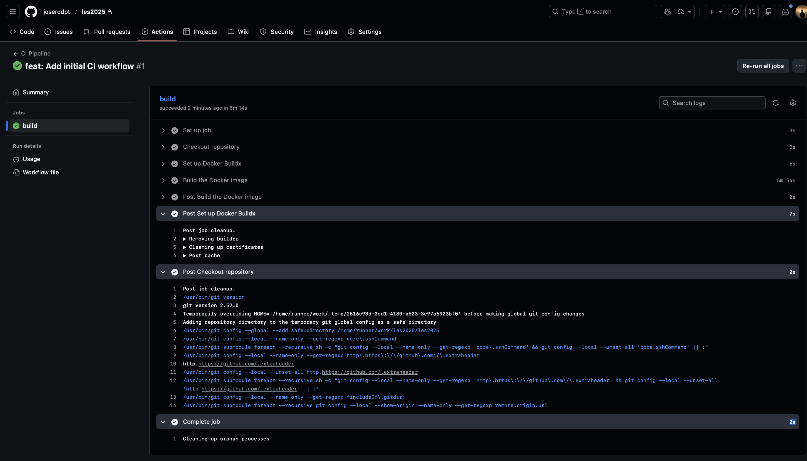
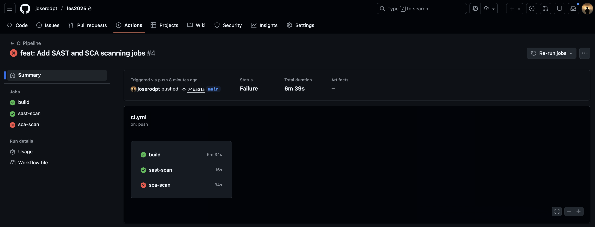
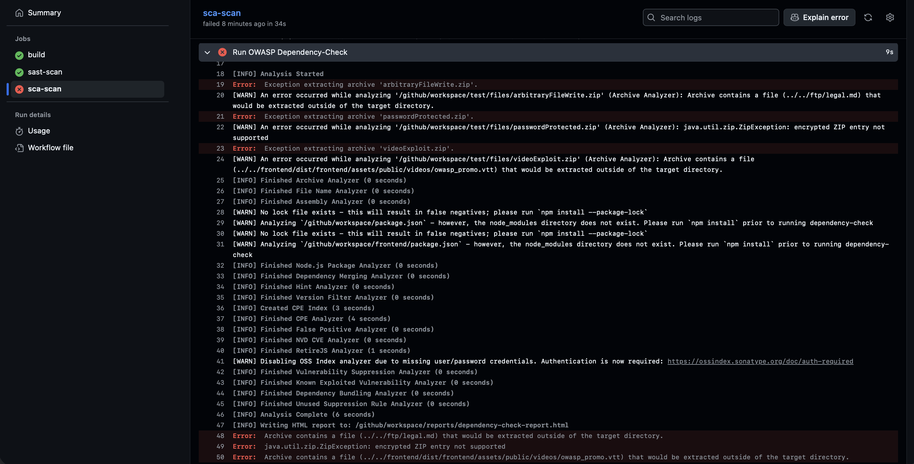

# LES 2025 - Automation-SecOps module report - José Rodrigues [uc2021235353]

## Phase 1 - The CI Foundation - Building the Container

```yaml'
name: CI Pipeline

on:
  push:
    branches: ["main"]

jobs:
  build:
    runs-on: ubuntu-latest

    steps:
      - name: Checkout repository
        uses: actions/checkout@v4

      - name: Set up Docker Buildx
        uses: docker/setup-buildx-action@v3

      - name: Build the Docker image
        uses: docker/build-push-action@v5
        with:
          context: .
          push: false
          tags: juice-shop-image:latest
```

### Sections
- `on` Specifies the events that trigger the workflow. Here, it is set to run on a push to the main branch.
- `jobs` This section contains all the jobs that will be executed as part of the workflow.
- `build` This is the name of the job that will be run.
- `runs-on` This specifies the type of virtual machine/runner to use, which is ubuntu-latest in this case.
- `steps` This section lists the individual steps that will be executed in the job.
  - `Checkout repository` This step uses the `actions/checkout@v4` to check out the repository code.
  - `Set up Docker Buildx` This step uses the `docker/setup-buildx-action@v3` to set up Docker Buildx, which is a tool for building Docker images.
  - `Build the Docker image` This step uses the `docker/build-push-action@v5` to build the Docker image with the specified context and tags.

Screenshots:


Running the action


Successful run

## Phase 2 - Integrating SAST and SCA Scanning

```yaml'
sast-scan:
  runs-on: ubuntu-latest
  steps:
    - name: Checkout repository
      uses: actions/checkout@v4

    - name: Run Semgrep SAST Scan
      uses: returntocorp/semgrep-action@v1

sca-scan:
  runs-on: ubuntu-latest
  steps:
    - name: Checkout repository
      uses: actions/checkout@v4

    - name: Run OWASP Dependency-Check
      uses: dependency-check/Dependency-Check_Action@main
      with:
        project: "juice-shop"
        path: "."
        format: "HTML"
        out: "reports"
        args: "--disableYarnAudit"
```


### 1. Job Analysis

- `sast-scan` Performs a Static Application Security Testing (SAST) scan using Semgrep.
  1.	Checks out the repository
  2.	Runs Semgrep.
	Semgrep scans the source code for:
		-	insecure patterns
		-	bad practices
		-	known vulnerability signatures

- `sca-scan` Performs Software Composition Analysis (SCA) using OWASP Dependency-Check.
	1.	Checks out the repository
    2.	Runs Dependency-Check. 
  This action generates a vulnerability report located in /github/workspace/reports/dependency-check-report.html

### 2. How GitHub Actions Knows Where to Find uses clauses

owner/repo@version
The clause is parsed as:
-	`owner` the GitHub account or organization
-	`repo` the repository containing the action
-	`@version` → which version/branch/commit to use

It will pull the action code from GitHub automatically into the runner for the action.

Examples:
- actions/checkout@v4 (from GitHub, https://github.com/actions/checkout)
- returntocorp/semgrep-action@v1 (from GitHub, https://github.com/returntocorp/semgrep-action)

Screenshots:


Finished run with errors


The errors come from the SCA scan that found vulnerabilities, so it failed.

### 3. “Error: Archive contains a file (../../ftp/legal.md) that would be extracted outside of the target directory.”

Report: Explain, in your own words, why this error is occurring and identify the source of the
threat. Why is this threat dangerous? Provide evidence that you located the threat. Why does the
build workflow continue and finish despite these errors?

The error points to a path traversal vulnerability in one of the dependencies of the project. The zip contains a file (`../../ftp/legal.md`) with a path that includes `../..`, which allows it to escape the intended extraction directory.
This threat is dangerous because it can allow an attacker to deploy files outside of the intended directory, potentially bypassing security checks without proper validation.

## Phase 3 - Container Image Security Scanning

Report: Analyze the new content of the ci.yml and describe the work performed by each of the
jobs. What is the final output of the workflow deployed in the pipeline? Explain and justify the
results you obtained in a clear way, providing evidence for why you got that outcome.

## Phase 4 - Implementing Security Gates and Breaking the Build

Report: Analyze the new content of the ci.yml and describe the work performed by each of the
jobs. What is the final output of the workflow deployed in the pipeline? Explain and justify the
results you obtained in a clear way, providing evidence for why you got that outcome.

Report: For each of the gates previously discussed, describe and analyze their output in a
pragmatic way, giving your personal thoughts of the outcome obtained.